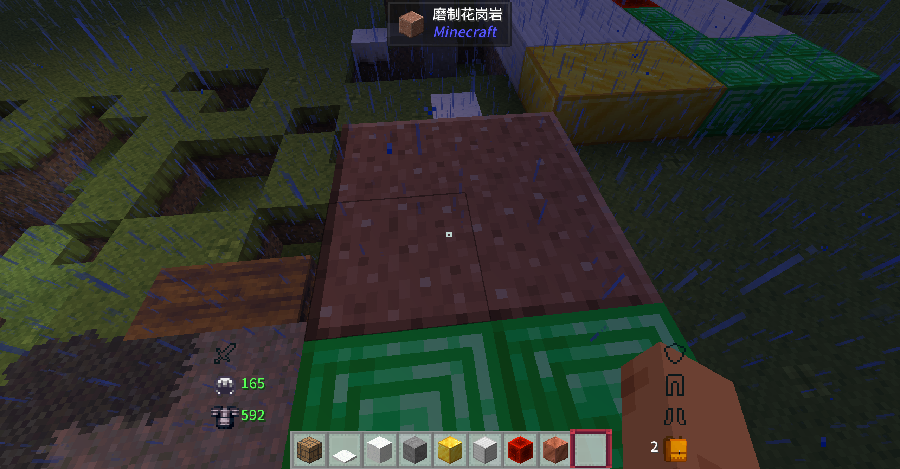
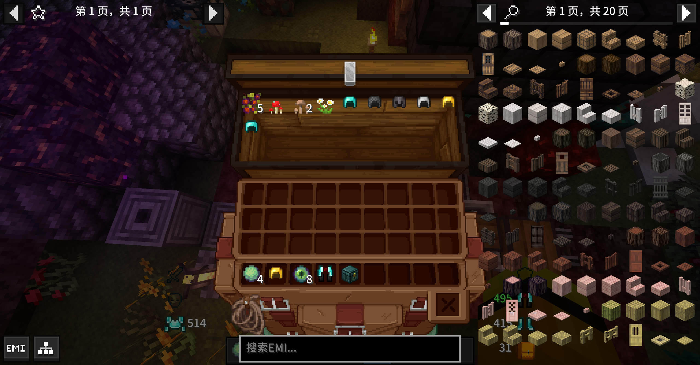
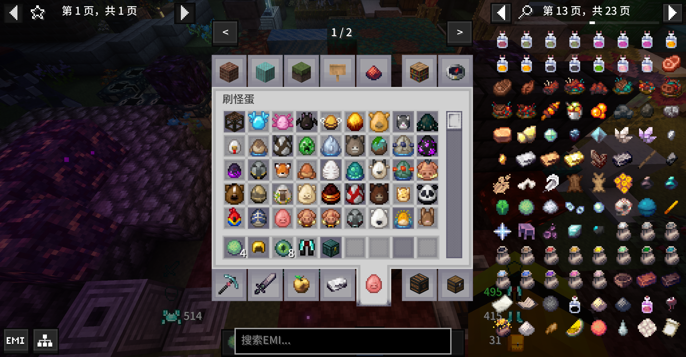
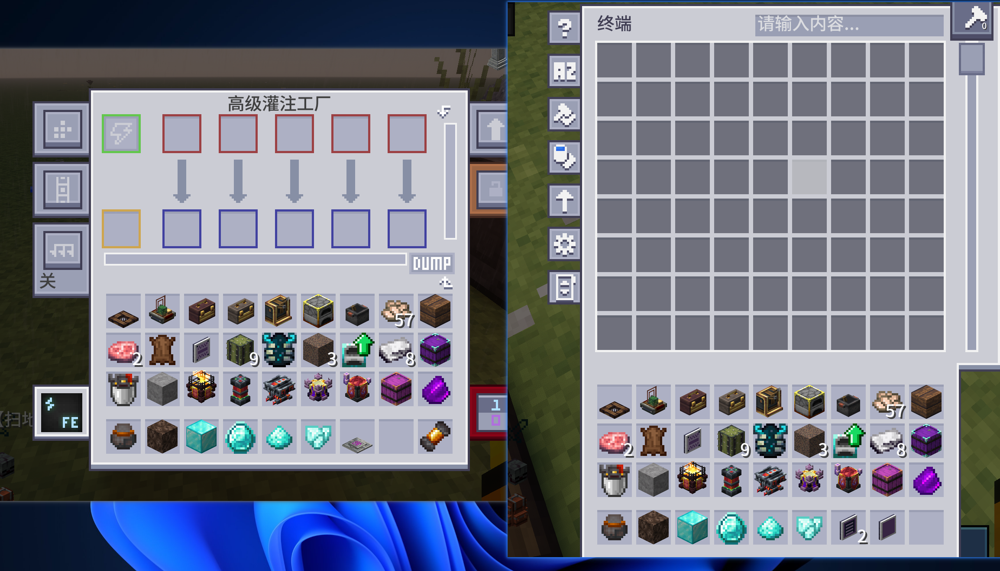

# 自制自用 Minecraft 资源包

### 最简单的食用方法​​

👉 下载模组 [**全局数据包** - Global Packs](https://www.mcmod.cn/class/2826.html)

然后游戏内把这仨资源包按需选中应用就行了，最好开着光影使用

>  因为资源包中包含了数据包 `Data` ，而 [**全局数据包** - Global Packs](https://www.mcmod.cn/class/2826.html) 可以直接加载材质包中的数据包(YYDS)，因此提供了一种最简单的全局使用数据包的方法

> [!NOTE]  
>
> 资源包大致分为三大模块:

## 材质包 (本质上是缝合怪) 

> [!IMPORTANT]
>
> 前置模组：
>
> - [**实体纹理特性** - Entity Texture Features  |  ETF](https://www.mcmod.cn/class/5862.html)
>- [**实体模型特性** - Entity Model Features  |  EMF](https://www.mcmod.cn/class/9909.html)
> - \[ 可选 \] [**Fusion ** - Connected Textures](https://www.mcmod.cn/class/11194.html)

#### 方块连接纹理，尤其是玻璃

#### 沉浸式GUI

#### 生动形象的刷怪蛋

#### 方块过渡纹理

#### 精致生动的草方块

#### 3D 农作物

#### 更有趣的生物模型和纹理

#### 模组 GUI 适配

### ...等等小细节，反正就是缝合大杂烩，然后适当兼容

## 汉化包

主要是 Ai 翻译，算是 i18n 官方的一个查缺补漏，包含了`资源包`汉化和`VP硬编码`汉化

> [!IMPORTANT]
>
> VP 硬编码基于模组 [**保险库补丁** - VaultPatcher](https://www.mcmod.cn/class/8765.html)
>
> 具体用法可自行查阅B站教程

## 兼容包

算是材质包的一个补充，针对各种模组的适配，里面包含了自己日常使用的数据包，方便各种模组之间的兼容和联动，还有就是对于模组材质包的兼容和重绘

